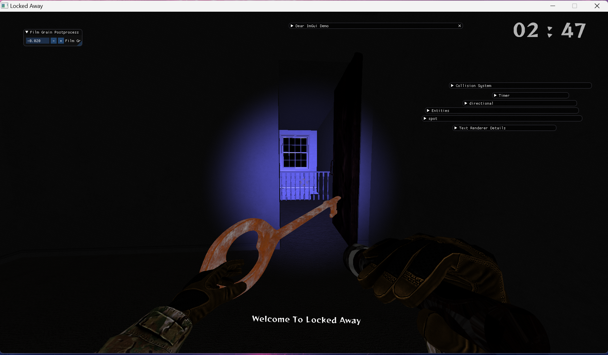
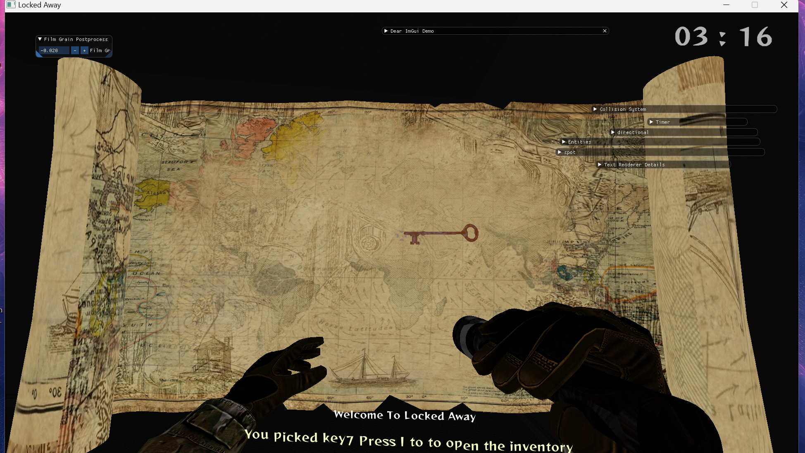
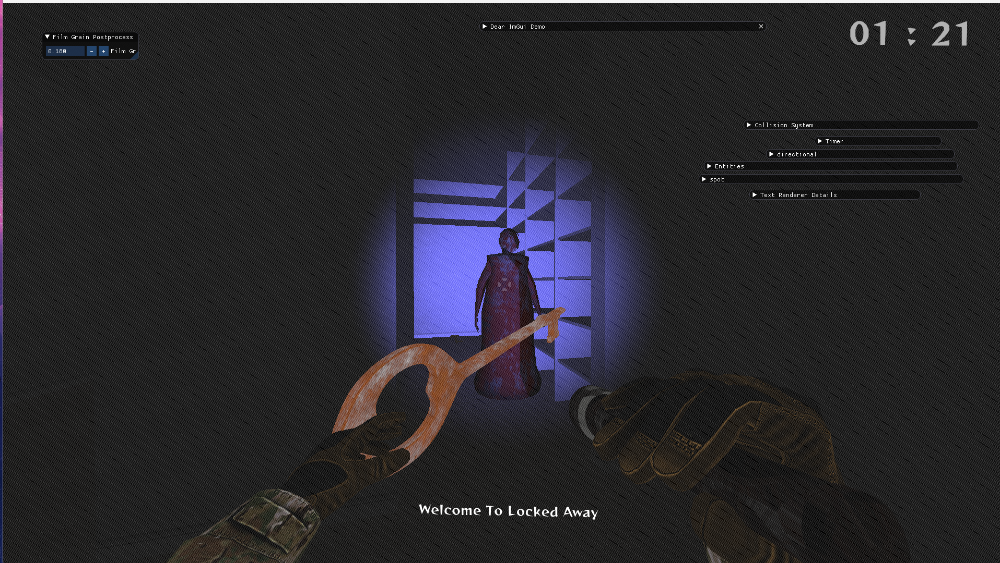
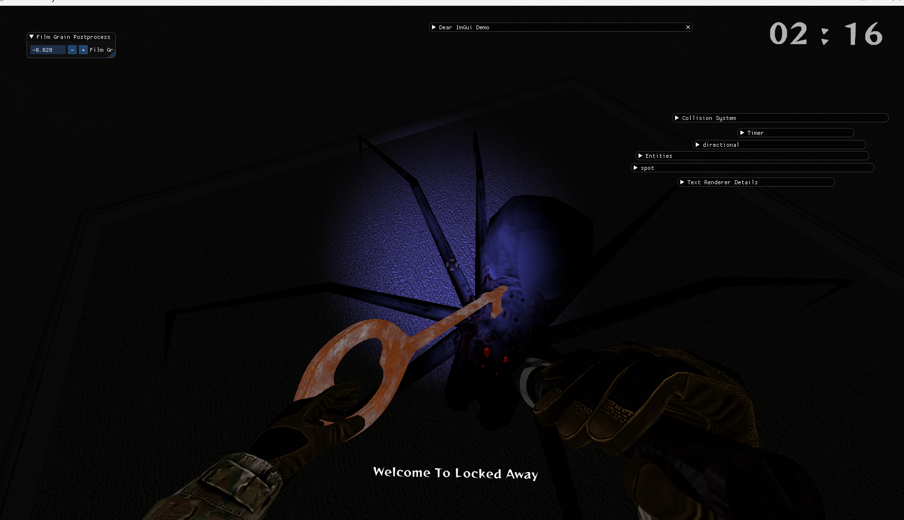

## Game Description

### The idea of the game is to escape from the horror house in the given time or you lose. To win you should search the house for the keys until you find the key of the main door of the house.

## Screenshots of the game

## Link to the Game Trial Video 

https://www.youtube.com/watch?v=B7hyZOUxibo

## Game Controls :

**Movement:**

- Use WASD keys to control movement:
    - W: Forward
    - A: Left
    - S: Backward
    - D: Right
      **Inventory:**

- Right-click:
    - Pick up objects and add them to your inventory.
    - (Optional) If already holding an object, it will be automatically added to the inventory when picking up a new
      one. **

**Inventory**

- I: Show inventory
- ESC: Hide inventory

**Interaction:**

- Right-click: Open doors if cursor is pointing to them

# Hot Graphics Engine Parts

## Lighting

### 1. Cook-Torrance BRDF

#### Description:

The Cook-Torrance BRDF (Bidirectional Reflectance Distribution Function) is a cornerstone of the Hot Graphics Engine's
lighting system. It accurately models how light interacts with surfaces, considering factors like surface roughness and
microfacet distribution. By implementing the Cook-Torrance BRDF, the engine achieves realistic lighting effects,
including specular highlights and reflections.

#### Implementation:

The engine calculates the Cook-Torrance BRDF during the shading process for each surface point. It takes into account
parameters such as surface roughness, Fresnel factor, and microfacet distribution, providing accurate lighting
calculations that contribute to the overall visual fidelity of rendered scenes.

### 2. Normal Maps (TBN)

#### Description:

Normal mapping is an essential technique in the Hot Graphics Engine for adding detail to surfaces without increasing
geometric complexity. The TBN (Tangent, Binormal, Normal) matrix transforms normals from the texture space to the world
space, ensuring accurate lighting calculations on surfaces with intricate details.

#### Implementation:

The engine supports the use of normal maps, which encode surface normals at each texel of a texture. During rendering,
the TBN matrix is used to transform the normals from the texture space to the world space or view space. This allows for
precise shading of surfaces with detailed geometric features, enhancing the realism of rendered scenes.

### 3. Light Material / Light Components

#### Description:

Light materials and components play a crucial role in the Hot Graphics Engine's lighting system, governing how surfaces
interact with light sources. Light materials define properties such as diffuse reflectance, specular reflectance,
roughness, and metalness, while light components encompass various types of lights in the scene, such as directional
lights, point lights, and ambient lights.

#### Implementation:

The engine provides a flexible system for defining light materials and components, allowing developers to customize the
lighting properties of surfaces and the behavior of light sources. This includes specifying material properties like
albedo color, specular intensity, and roughness, as well as configuring different types of lights and their parameters,
such as position, intensity, and falloff.

### 4. Color Mask

#### Description:

The color mask is a valuable feature of the Hot Graphics Engine's lighting system, enabling artists and developers to
apply selective coloring to different parts of objects or scenes. By defining a mask texture, users can designate
specific areas to receive distinct colors, enhancing visual variety and artistic expression in rendered scenes.

#### Implementation:

The engine supports the use of color masks as additional texture layers, which are applied during the rendering process
to modulate the final color output. Developers can create custom mask textures to control the distribution of colors
across surfaces, allowing for creative effects such as weathering, decals, or material variations.

### 5. Albedo Intensity

#### Description:

Albedo intensity adjustment provides fine-grained control over the brightness of surface colors in the Hot Graphics
Engine. By adjusting the intensity of the albedo color, developers can dynamically modify the overall brightness of
surfaces, allowing for precise control over lighting conditions and mood in rendered scenes.

#### Implementation:

The engine allows developers to specify the intensity of the albedo color for each surface material, either globally or
on a per-object basis. This parameter scales the base color of the surface, affecting its perceived brightness when
illuminated by light sources. By dynamically adjusting albedo intensity, developers can achieve desired lighting effects
and visual aesthetics in their scenes.

## Physics

### The Physics system includes several features including the following:

- ### Moving smoothly on Ground and climbing stairs with animation
    - Checks if player can move on ground by getting the closest ground.
    - Casts a ray from camera down to ground (specified distance).
    - Returns ground/stair entity ID if collision detected within distance, or 0 otherwise (camera not found or no
      collision).

- ### Mesh Collision Detection
  This was implemented in several ways:
    - AABB bounding box + hand ray casting
        - This was the first approach where it's results were not that accurate
    - Convex Polyhedron using Bullet Physics Library

- ### Picking Items
    - GPU Accelerated Picking which uses the Frame buffer and the color buffer for identifying the items picked by the
      cross hair or the mouse.
    - Using Bullet Physics and applying Ray Casting to get the picked objects.

## Sound

- Sounds in the graphics engine were played using Mini Audio, which is a single header file
- Audio system was added to manage the current played song and allow other systems to communicate with sounds when
  events triggered

## Text Rendering

- Text Rendering was applied by applying shaders in the Forward Renderer phase

## Game Logic Systems

- ### Door Opening Systems

The Door system is responsible for opening and closing the door when the correct key is picked by the user in hand.
It's responsible for matching the keys and handling the rotation and transition of doors.

- ### Inventory System

It's responsible for handling the keys of the user in one place allowing the user to navigate between the collected keys
freely

# The Solution of the game

- Door 7 --> Door 8 --> Door 5 --> Door 6 --> Door 4 --> Door 2 --> Door 3 --> Door 1 
